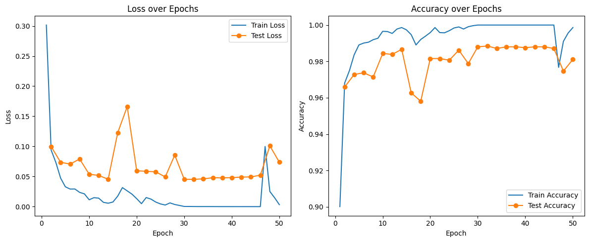
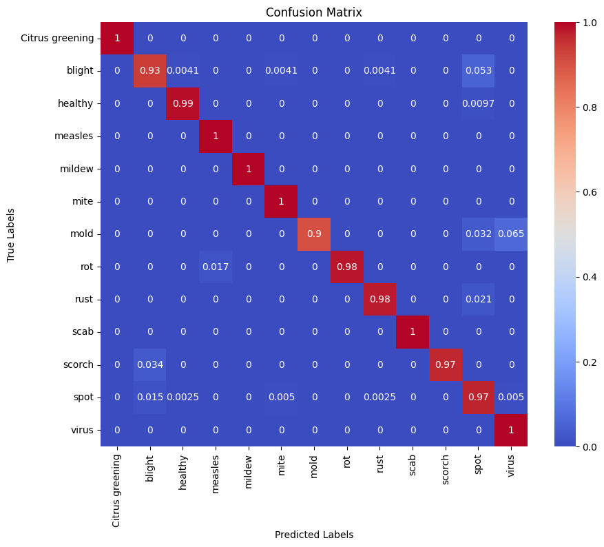
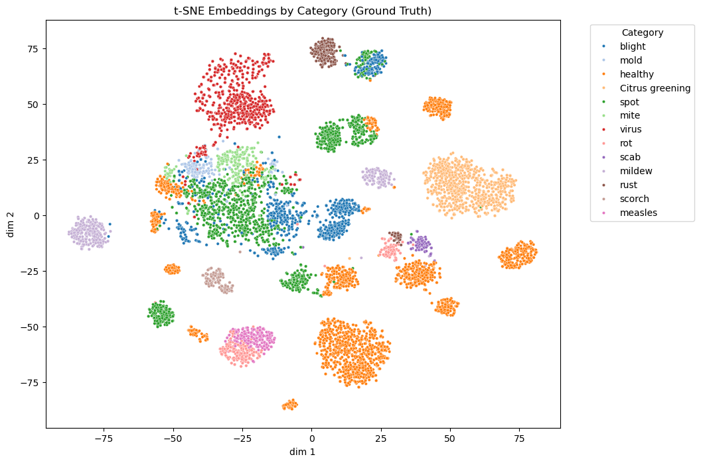
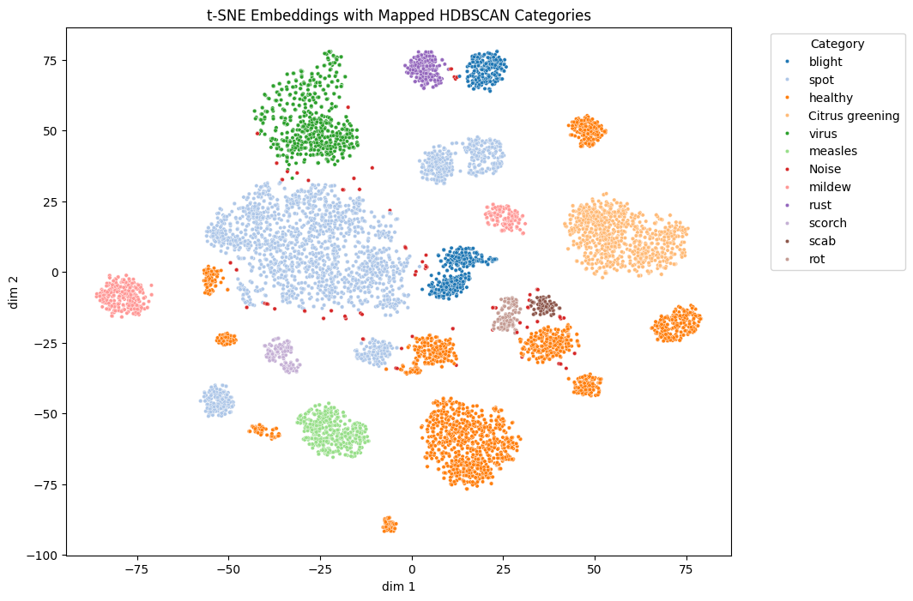
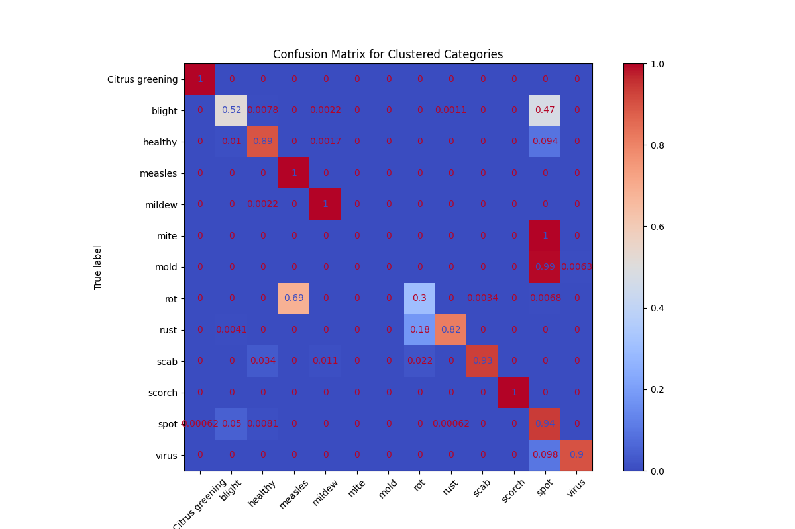
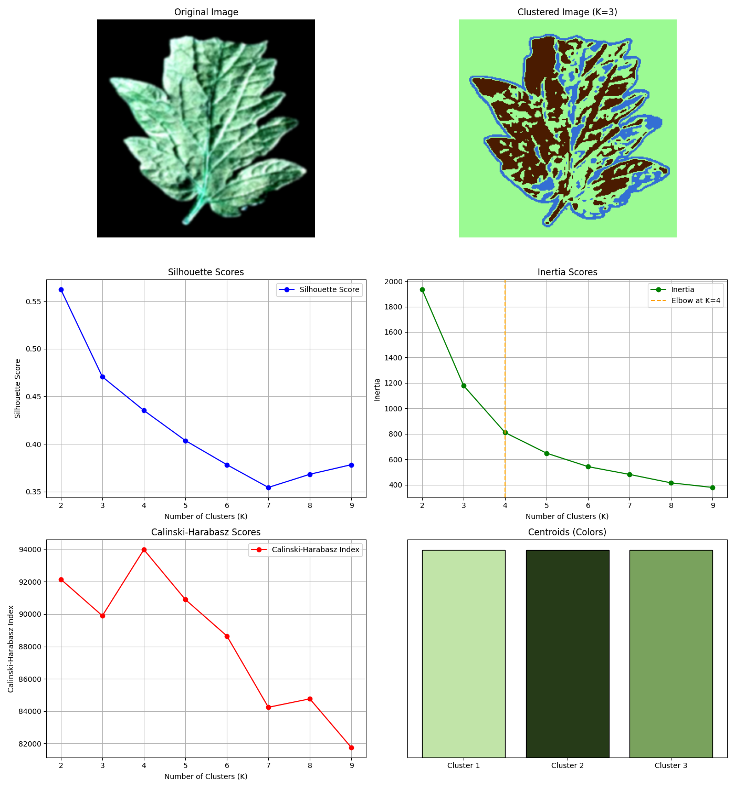

# Visually Identifying Plant Diseases 

            

# Project Overview

https://github.com/user-attachments/assets/a95bb722-c545-4f19-8631-45c37bfcd913

# Directory
<table>
  <thead>
    <tr>
      <th>
        File/Directory
      </th>
      <th>
        Purpose
      </th>
    </tr>
  </thead>
  <tbody>
    <tr>
      <td>
        /dataset/raw
      </td>
      <td>
        The raw dataset containing images of plants and their labels
      </td>
    </tr>
    <tr>
      <td>
        /dataset/dataset_metadata/test_set.csv
      </td>
      <td>
        Mappings for disease and plant type for each image file that we extracted
        (for testing)
      </td>
    </tr>
    <tr>
      <td>
        /dataset/dataset_metadata/training_set.csv
      </td>
      <td>
        Mappings for disease and plant type for each image file that we extracted
        (for training)
      </td>
    </tr>
    <tr>
      <td>
        /dataset/img_embeddings/test_img_embeddings.pt
      </td>
      <td>
        Image embeddings for the test data stored as a tensor file, for quicker
        access once embeddings are processed
      </td>
    </tr>
    <tr>
      <td>
        /dataset/img_embeddings/train_img_embeddings.pt
      </td>
      <td>
        Image embeddings for the training data stored as a tensor file, for quicker
        access once embeddings are processed
      </td>
    </tr>
    <tr>
      <td>
        /images
      </td>
      <td>
        Images used in this README file
      </td>
    </tr>
    <tr>
      <td>
        /images/confusion_matrix_tsne.png
      </td>
      <td>
        A confusion matrix evaluating the accuracy of the t-SNE model on clustered categories of disease types
      </td>
    </tr>
    <tr>
      <td>
        /images/kmeans_visualization.png
      </td>
      <td>
        A group of graphs and K-Means visualization that shows clustering of colors on a sample image alongside standard K-means evaluation metrics
      </td>
    </tr>
    <tr>
      <td>
        /images/mlp_training.png
      </td>
      <td>
        A graph showing the loss and accuracy of the MLP model over its training period
      </td>
    </tr>
    <tr>
      <td>
        /images/sample_processed.png
      </td>
      <td>
        A leaf image post-pre-processing that was used in creating the K-Means visualization
      </td>
    </tr>
    <tr>
      <td>
        /images/supervised_mlp_confusion_matrix.png
      </td>
      <td>
        A confusion matrix demonstrating the accuracy of the MLP model
      </td>
    </tr>
    <tr>
      <td>
        /images/tsne_ground_truth.png
      </td>
      <td>
        t-SNE visualization showing embeddings colored by ground truth categories
      </td>
    </tr>
    <tr>
      <td>
        /images/tsne_hdbscan_mapped_categories.png
      </td>
      <td>
        t-SNE visualization showing embeddings colored by HDBSCAN-generated categories
        mapped to ground truth
      </td>
    </tr>
    <tr>
      <td>
        /src/dataset_creation.ipynb
      </td>
      <td>
        Jupyter notebook that manually processes the raw data by filling in missing labels and mapping images to metadata (see details in methods)
      </td>
    </tr>
    <tr>
      <td>
        /src/embedding_extraction.ipynb
      </td>
      <td>
        Jupyter notebook that performs pre-processing on our data using the DinoV2
        encoder and stores image embeddings
      </td>
    </tr>
    <tr>
      <td>
        /src/supervised_mlp.ipynb
      </td>
      <td>
        Trains and evaultes the MLP model to identify diseases given images
      </td>
    </tr>
    <tr>
      <td>/src/unsupervised_tsne.ipynb</td>
      <td>
        Projects embeddings and runs clustering to identify disease types using methods like HDBSCAN for unsupervised clustering, leveraging t-SNE for dimensionality reduction.
      </td>
    </tr>
    <tr>
      <td>/src/unsupervised_kmeans.ipynb</td>
      <td>
        Runs a K-Means clustering algorithm utilizing the primary colors present on leaf images to predict plant health, and performs model evaluation based on ground truths provided by the dataset.
      </td>
    </tr>
    <tr>
      <td>
        /mlp_checkpoint.pth
      </td>
      <td>
        The MLP model trained on our pre-processed data
      </td>
    </tr>
    <tr>
      <td>
        /requirements.txt
      </td>
      <td>
        Text file containing all packages used for easy reproducibility
      </td>
    </tr>
  </tbody>
</table>

## Introduction and Background

Plant disease is an issue that has wide-ranging effects on our society. Global supply chains can be disrupted by outbreaks, affecting not only people that need food the most but also global economies [1]. Disease identification has been done in a variety of ways, from chemical tests to DNA analysis [2], but recently, computer science has been able to help. Researchers have taken deep learning approaches [3] and others have created integrated pipelines for farmers [4]. Through our project, we aim to do the same with a [Kaggle Dataset of identified plant diseases](https://www.kaggle.com/datasets/vipoooool/new-plant-diseases-dataset).

This Dataset contains 87,000 labeled images of either healthy or diseased plants for multiple types of crops (corn, apples, grapes, etc.). There are 38 different classifications of crops in total.

## Problem Definition

We aim to provide tools to reliably identify whether or not a plant is healthy given images of its leaves. We also aim to be able to reliably identify the type of disease the crop has.

As described above, crop diseases, especially when unidentified, could have immense negative effects. This field can greatly benefit from ML tools as farmers could integrate their own knowledge with capable models to better identify these diseases.

## Methods

For the first unsupervised approach, we will pre-process the image by increasing contrast (PIL’s ImageEnhance.Contrast) to make different colors stand out and then use Gaussian blur (cv2.GaussianBlur) to smooth any noise. Then, we can set K to 2 and run K-means clustering (sklearn.cluster.KMeans) on the pixel colors. If the smaller cluster is above a certain size and the cluster mean difference is substantial, that would suggest that there are “unhealthy” colors on the leaf. To further classify diseases, we can separate images based on what color the smaller cluster represents.

The second and third approach uses a pre-trained image encoder like DinoV2 to transform the images into latent embeddings. These encoders are pre-trained on large datasets and are reliable at identifying important image features through high dimensional vectors. The images are pre-processed by normalizing the colors for better encoding. The second approach involves running t-SNE (sklearn.manifold.TSNE) to project embeddings into 2D space and then running DBScan (sklearn.cluster.DBSCAN) to cluster the embeddings in an unsupervised fashion. Ideally, each cluster represents “healthy” or a type of a disease.

Finally, the last approach involves supervised learning using an MLP that takes in image embeddings and outputs a classification, trained on the labeled crop image dataset.

### Midterm Updates (Methods)

For the midterm checkpoint, we implemented the final supervised learning method using an MLP. We also began implementing the t-SNE approach. Both of these were used in conjuction with the DinoV2 encoder to pre-process input data. Furthermore, we had to perform some manual data cleaning.

More specifically, we had to first read in the data from the dataset and fix some disease category names. For example, plants with "rust" did not have their label included in the dataset, so we had to manually add that in. We then stored this clean data in a csv file that maps picture filename to their plant type and disease type. We then used the DinoV2 encoder to produce image embeddings that were ready for our MLP models. We used an Adam optimizer and tuned our hyperparameters to train our model, and ran tests to evaluate the accuracy of our model.

### Final Updates (Methods)

We finished implementing the t-SNE approach and implemented a K-Means approach for detecting disease types. We continued to use the same DinoV2 pre-processing steps for the t-SNE approach since we demonstrated in our midterm checkpoint that we were able to conserve relevant data to identify disease types, both visually and through the success of our MLP. However, we pre-processed our data differently for K-means since we observed while developing the K-means model, we were having better success on the raw images with more minor modifications.

For the t-SNE approach, we utilized sklearn's implementation. We first had to reduce the dimensionality of the embedding data to two-dimensional space, which we did using sklearn's TSNE utilities. We then normalized the features such that their mean was zero and they had a standard deviation of one, before applying a HDBSCAN clustering algorithm. DBSCAN is a clustering algorithm that clusters points in our two-dimensional space based on their density, and HDBSCAN extends this by being able to distinguish between multiple levels of density throughout the 2D space. We tuned the hyperparameters of this model visually, but eventually, as discussed in the results, we were not able to achieve accurate results with t-SNE and HDBSCAN.

For the K-Means model, we focused on identifying pixel regions of discoloration, that we found is indicative of diseases on plant leaves. We were able to identify standard colors that indicate health on different leaves, and we discriminated these pixel regions based on that. Similar to t-SNE and HDBSCAN, we used sklearn's implementation. For the pre-processing, the main change to the image was simply increasing the contrast and applying a Gaussian blur. We then masked the black background present on all the images in order to just focus on the leaf, and ran our clustering algorithm. We collected the clusters and their identified labels, and applied standard K-means evaluation metrics that are explained below.

## Results and Discussion

We aim to use three metrics for our results: Accuracy, F1-Score, and Silhouette Score.

Accuracy assesses the overall correctness of our model. We aim to have an 85% accuracy rate for K-Means and DBScan in identifying diseased plants and an 80% for MLP in identifying the diseases themselves. We'll use the F1-Score to measure how balance precision and recall, particularly for disease classification. Our aim is a 0.80 F1 score across all categories. Finally, since we have clustering approaches, we'll use a Silhouette Score to evaluate how well data points fit within clusters. Our goal is a 0.6 average score across all clusters.

Our goal, as mentioned earlier, is to accurately identify plant diseases. We believe that if our models match these metrics, we'd have reliable tools that identify crop diseases and lead to earlier solutions to far-reaching problems. Since our problem's goal is to aid the environment, we want to ensure our models are energy-efficient. There are tools that can measure the carbon impact of code like Code Carbon [5], and we aim to use these tools to reduce our environmental impact.

### Midterm Updates (Results)

When training our MLP model, we were able to evaluate its performance:

As expected, the loss decreased and the accuarcy increased as we trained the model. After the final epoch, the model was able to acheive a training accuracy of 99.86% and a test accuracy of 98.11%. This was much higher than our initial goal of 80%, and this tells us that our pre-processing methods combined with our model were appropriate methods of handling the data we were given. Our MLP model performs well because MLP is well-suited for image classification tasks where we need to analyze non-linear data. This allows us to process detailed patterns, such as specific discolorations or rot, where a linear model would likely fail. Furthermore, each feature in a data point corresponds to a single perceptron in the first layer, which allows the model to pick up on specific areas that indicate diseases in our processed images. We plan to adjust the pre-processing as we move forward to see if we can extract features that would allow the MLP model to better pick up on indicates of certain diseases. We will aim for a 99% accuracy.

### Final Updates (Results)

We built on the evaluation of our MLP model by creating a confusion matrix:

We also did try to further tune this model, as we mentioned we would during the midterm report. We were able to obtain marginal improvements while modifying the pre-processing methods and hyperparameters, so we left the final model unchanged. This confusion matrix does represent our previous conclusions that this is a precise, accurate model for identifying disease types. We can see that some disease types are correctly classified for all data points, and the ones that are sometimes incorrectly classified are rarely misclassified. Furthermore, upon looking at these misclassifications, the diseases that are misclassified as one another are easily mistakeable to the human eye since they manifest in similar features. This shows that even the inaccuracies in our model are not due to model development but rather features that are heavily related.

We now move on to the evaulation of our t-SNE approach along with HDBSCAN. Below, we have two images. The first is the ground truth for t-SNE embeddings that we projected into two-dimensional space. We can immediately see that this data after being processed like this may not be suitable for K-Means since the data points are not clearly separated, and we discuss this in the K-Means evaluation below. However, HDBSCAN observes density, and we can see that most diseases have distinct groups of differing densities. The second image shows the result of applying HDBSCAN and the assigned labels of clusters:

We immediately notices that there is a discrepancy between the ground truth and mapped categories. The clusters that are separated are validly and accurately identified, but there is a group of diseases that does not have clear separation. The HDBSCAN model failed to identify changes in density among these individual diseases and rather classified the single grouping of diseases as all "Spot" disease. We can look at a Confusion Matrix to get a clearer understanding of the misclassification:

We see what we just discusses corroborated. Certain diseases still have high accuracy when being predicted, but there are a few that are consistently mispredicted. Quantitatively, we calculated the following metrics:

Silhouette Score: 0.4828

Purity: 0.8196

Adjusted Rand Index (ARI): 0.6748

Fowlkes-Mallows Index (FMI): 0.7347

Silhouette score measures how well-matched points are to their own clusters. A value of 1 indicates that points are matched to their proper clusters, while -1 indicates the opposite. We see a score of 0.4828 which means that we do have, on average, correct matching, but there is space for improvement in performance. Purity provides similar insights, measuring how well each cluster represents a single category. This metric ranges from 0 to 1, and again, we do see moderate performance, but there is room for improvement. Adjusted Rand Index measures similar metrics to the other two, where a zero indicates that we have clustering on the level of random clustering, and a 1 indicates well-matching. A Fowlkes-Mallows Index of 1 indicates good precision and recall results. Again, our numbers show valid clustering and better-than-random disease identification, but models such as our MLP approach perform better.

We now discuss the results of our KMeans Visualization. Below is a graphic that demonstrates the performance of our model on a single sample and visualizes a few evaluation metrics:

On the top left, we see a pre-processed image, and right next to it, we see the results of the K-Means clustering. We have segmented the image into three clusters of similar color, highlighting the large differences in coloration that often indicate types of disease. This clustering illustrates the areas that potentially signify varying stages of plant health or disease. As previously noted, large discrepancies in color from a healthy green typically suggest possible health issues. The chosen k=3 for our model reflects this, as the silhouette score—a measure of how well points match to their cluster—gives us a moderate value of approximately 0.47, suggesting that the clustering, while effective, might not be perfectly distinct.

To determine if a leaf is healthy or diseased, we used the results of KMeans clustering to categorize pixel intensities into groups based on their differences in levels of plant health. Specifically each cluster represents a specific range of color variations, from healthy green to discolored patches. By analyzing the distribution of these clusters of centroids across the leaf's surface, we are able to determine the degree of these affected areas and make an initial assessment on the plant's health.

Despite the silhouette score suggesting that a k=2 might offer a tighter clustering, we opted for k=3 to capture a broader spectrum of disease indicators, based on additional metrics that provide deeper insights into cluster quality. The inertia score, which gauges the compactness of the clusters by the distances from points to their centers, indicated that the decrease in inertia levels off at k=4, as visualized by the elbow method we employed. Moreover, the Calinski-Harabasz score, which evaluates both intra-cluster and inter-cluster variance, pointed to k=4 as providing more defined cluster separation.

However, after considering the practical relevance of the clusters for diagnosing specific plant diseases, we selected k=3 as the optimal number of clusters. This decision was based on the fact that it allowed us to differentiate between primary disease categories, which is important in practical types of applications. This choice was validated by the final accuracy we achieved, which was 71.43% with k=3. We noticed these results were very similar to those obtained from employing t-SNE with HDBSCAN earlier on, which suggests some consistency across different clustering methodologies in identifying disease patterns. This similarity makes sense as HDBSCAN tends to create circular clusters which aligns with the effectiveness of our K-Means application in this context.

### Final Updates (Discussion)

In the end, we observed an accurate performance from the MLP but an underwhelming performance from the two unsupervised approaches. The reason for this is because the MLP model was trained entirely on the embeddings, and the DinoV2 encoder and embedding creation process is optimized to store relevant patters in images. The MLP model was able to consider all of this information and therefore capture more subtles patterns than either of the two unsupervised approaches were. The reason the unsupervised approaches did not work well was also primarily because of the dimensionality reduction, as we had to project our data to lower dimensions which likely lost critical data and the subtle differences that are necessary to identify plant diseases. 

In the end, though, we were able to come out with a highly precise and accurate method of detecting plant diseases: the MLP. This means it is possible to combat the challenges we discussed in our introduction and use ML in fields such as agriculture and plant life. Speaking more technically, we have shown that we have modern, easy-to-access ML methods to perform tasks that were previously limited to human eyes. We have models that can capture the complexities and subtleties of datasets in new ways, which can also help eliminate human error. If we were to develop our models further, we would have likely considered combining our clustering approaches with K-Means or t-SNE/HDBSCAN. This might have helped us improve the accuracy of our MLP by introducing outlier detection or subtleties that the feature reduction was able to pick up on. We would have also attempted more supervised learning approaches since this project demonstrated that such approaches are better suited or this task.

Apart from this, looking at the performance between the t-SNE/HDBSCAN and the K-Means more, we noticed some trade-offs, which suggesed to us more improvement areas of a future model. While t-SNE with HDBSCAN was able to take care of the high-dimensional data with its density-based clustering, it struggled in terms of categorizing closely related disease types because of the overlapping clusters and its high sensitivity to these parameters. On the other hand, for K-means it had a more straightforward and effective approach at identifying distinct color-based patterns related to health and diseases. However, it sometimes oversimplified the nature of the plant disease symptoms, leading to misclassifications where the visual symptoms did not distinctly align with the expected color patterns.

Finally, considering the overall future direction of our project, we believe that improving our integration of the supervised and unsupervised methods could offer more robust solutions. For instance, we could integrate our MLP approach with feature insights that were derived from unsupervised clustering to refine the model’s handling of rare disease manifestations. Additionally, exploring other methods that combine predictions from multiple models could probably be a good way for us to balance the strengths and mitigate the weaknesses of each approach that we mentioned earlier. This strategy would allow for more accurate disease identification, allowing not only us but agricultural workers to have access to better decision-making tools.
 
## References

[1] P. Mills et al., “Integrating natural and social science perspectives on plant disease risk, management and policy formulation,” Philosophical Transactions of the Royal Society B: Biological Sciences, vol. 366, no. 1573, pp. 2035–2044, Jul. 2011, doi: https://doi.org/10.1098/rstb.2010.0411.
 
[2] P. A. Nazarov, D. N. Baleev, M. I. Ivanova, L. M. Sokolova, and M. V. Karakozova, “Infectious plant diseases: etiology, current status, problems and prospects in plant protection,” Acta Naturae, vol. 12, no. 3, pp. 46–59, Oct. 2020, doi: https://doi.org/10.32607/actanaturae.11026.
 
‌[3] O. Kulkarni, “Crop Disease Detection Using Deep Learning,” IEEE Xplore, Aug. 01, 2018. https://ieeexplore.ieee.org/document/8697390
 
[4] D. Tirkey, K. K. Singh, and S. Tripathi, “Performance analysis of AI-based solutions for crop disease identification, detection, and classification,” Smart Agricultural Technology, vol. 5, p. 100238, Oct. 2023, doi: https://doi.org/10.1016/j.atech.2023.100238.
 
[5] A. Lacoste, A. Luccioni, V. Schmidt, and T. Dandres, “Quantifying the Carbon Emissions of Machine Learning,” arXiv:1910.09700 [cs], Nov. 2019, Available: https://arxiv.org/abs/1910.09700
‌‌
